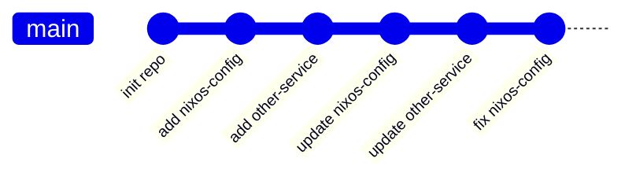
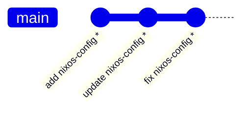

`git subtree` lets you embed one Git repository inside another as a subdirectory, while keeping both histories manageable. It ships with Git and requires no special tooling.

## The Problem It Solves

Say you maintain a monorepo but want to publish a subdirectory as a standalone public repo. You could manually copy files, but you'd lose history. You could use a submodule, but collaborators would need to remember to run `git submodule update`. Subtrees let you keep everything in one repo locally and push a clean, filtered view to a separate remote.

Common use cases:

- Publishing a config repo from a monorepo as a public mirror
- Sharing a library between projects without a package registry
- Keeping vendor code in-tree with the option to pull upstream changes

## The Core Mental Model

A subtree is just a directory in your repo. There is no `.gitmodules` file, no pointer commit, no special metadata. To your collaborators, `git clone` just works — they get everything in one shot.

The magic happens in two commands: `git subtree split` and `git subtree merge`. These rewrite history to filter or inject commits that touch a given prefix.

## How History Rewriting Works

This is the key concept. When you push a subtree, Git rewrites your commits.

**Your monorepo history** mixes commits across all folders:



**After `git subtree split --prefix=nixos-config`**, Git walks the history and replays only the commits that touched `nixos-config/`, rewriting them into a new linear sequence with **new SHAs**:



The asterisks represent new SHAs. The content is identical to what was inside `nixos-config/` at each point in time — but these are brand new commits with no ancestral relationship to your monorepo commits.

> **Warning**
> This SHA rewriting is the source of most subtree confusion. If you ever try to pull from a remote that was populated by a subtree split, Git will report "refusing to merge unrelated histories" — because from its perspective, the commits truly are unrelated.

## Setting Up a Subtree Remote

Add a remote for the standalone repo:

```bash
git remote add my-subtree git@github.com:you/your-repo.git
```

Then push the subtree for the first time:

```bash
git subtree push --prefix=my-folder my-subtree main
```

This runs `git subtree split` internally and pushes the result.

## Common Workflows

### Pushing changes

After committing changes to `my-folder/` in your monorepo:

```bash
git subtree push --prefix=my-folder my-subtree main
```

### Pulling changes made on the remote

If someone commits directly to the standalone repo and you want to bring those changes back:

```bash
git subtree pull --prefix=my-folder my-subtree main
```

This fetches the remote branch and merges it into your monorepo, scoped to `my-folder/`. It creates a merge commit.

### Adding an existing repo as a subtree

If you want to bring an external repo into your monorepo as a subdirectory:

```bash
git subtree add --prefix=my-folder my-subtree main --squash
```

`--squash` collapses the external history into a single commit, keeping your monorepo history clean.

## Subtrees vs. Submodules

|                      | Subtree                  | Submodule                       |
| -------------------- | ------------------------ | ------------------------------- |
| **Clone experience** | Transparent — just works | Requires `git submodule update` |
| **History**          | Embedded in main repo    | Separate repos, pointer commits |
| **Two-way sync**     | Possible, but fragile    | Clean — repos stay independent  |
| **Secret isolation** | Must verify manually     | Automatic                       |
| **Complexity**       | Low to medium            | Medium                          |

**Use a subtree when:**

- The standalone repo is mostly a read-only mirror of a monorepo subfolder
- You want zero extra steps for collaborators cloning the monorepo
- You control both repos and rarely commit to the standalone one directly

**Use a submodule when:**

- Both repos are actively developed independently
- You want pinned, auditable references to external code
- The external repo is maintained by another team

## Quick Reference

```bash
# Add a remote
git remote add <name> <url>

# Add an external repo as a subdirectory
git subtree add --prefix=<folder> <remote> <branch> --squash

# Pull remote changes back into the monorepo
git subtree pull --prefix=<folder> <remote> <branch>

# Push after committing changes
git subtree push --prefix=<folder> <remote> <branch>
```
