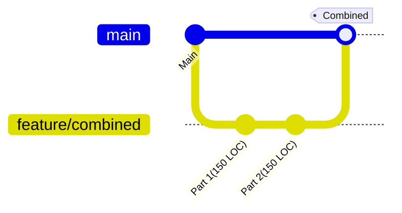
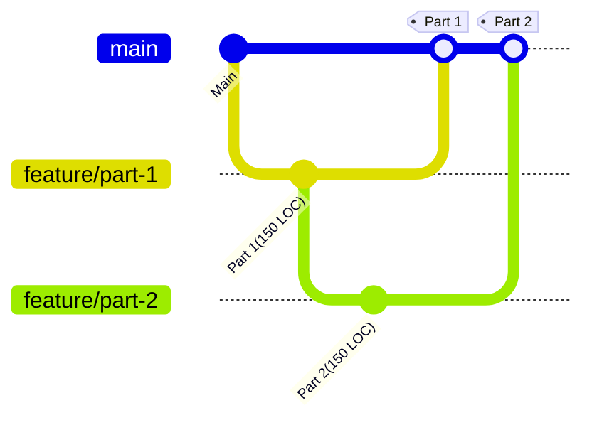

The larger the Merge Request, the less useful the feedback. When we ask a peer
to review a 50-line change, they find logic flaws. When we ask them to review
a 1,500-line change, they find typos. Huge MRs don't just take longer to review;
they lower the quality bar for the codebase. To fix the comment quality, the
issue is not the reviewer, but the size of the change. One solution to this
problem is stacked branches.

## What are Stacked Branches?

Stacked branches are a workflow where developers create a series of branches that
build on top of each other, allowing for incremental development and review. Each
branch represents a specific feature or change, and subsequent branches depend
on the previous ones.

Imagine a standard changeset containing two distinct features, each with 150 lines
of code. The changeset would be 300 lines of code. The history of the main branch
would look like this:

However, if we use stacked branches, we can split the changes into two separate branches,
each with a subset of the changes. The first branch would contain the first
feature, and the second branch would contain the second feature, which depends
on the first branch. This allows for smaller, more focused MRs that are easier
to review. With stacked branches, the history would look like this:

## Why Stack Branches?

The paper [Modern Code Review: A Case Study at Google](https://sback.it/publications/icse2018seip.pdf)
by Google found that the size of the change is the most significant factor in
determining the quality of code reviews. The paper finds that larger changes
lead to fewer useful comments and longer review latency. The paper states that
Google's median change size is 24 lines of code.

The paper [Best Kept Secrets of Peer Code Review](https://static0.smartbear.co/support/media/resources/cc/book/code-review-cisco-case-study.pdf)
by Cisco found that a reviewer will not be able effectively review more than
300-400 lines of code without a drop in review quality.

## How to Implement Stacked Branches?
