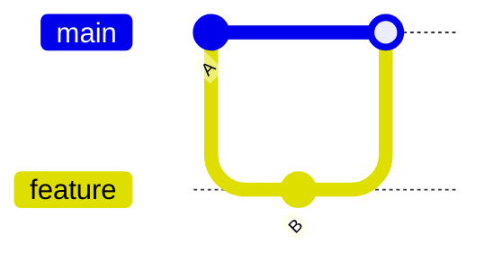
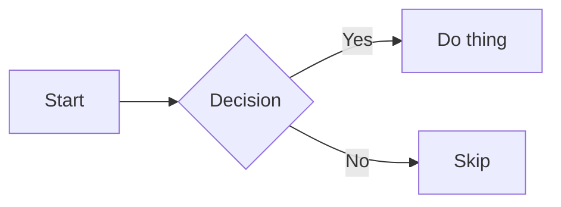

This guide shows advanced markdown patterns and examples useful for gardening and technical posts.

## Creating a Post

Add a `.md` file to `src/posts/`. The filename becomes the URL slug:

```
src/posts/my-post-title.md  →  /posts/my-post-title
```

Slugs should be lowercase with hyphens. No spaces or special characters.

## Frontmatter

Every post starts with a YAML frontmatter block:

```markdown
---
title: 'Your Post Title'
date: '2026-03-15'
description: 'A one-sentence summary shown on the listing page.'
---
```

| Field         | Required | Notes                                                 |
| ------------- | -------- | ----------------------------------------------------- |
| `title`       | Yes      | Displayed as the `<h1>` on the post page              |
| `date`        | Yes      | Must be `YYYY-MM-DD`. Controls sort order on `/posts` |
| `description` | No       | Shown as a subtitle on the listing page               |

## Basic Markdown Syntax

Standard Markdown works as expected.

### Headings

```markdown
## Section heading

### Sub-section
```

Use `##` and `###` inside posts — `#` is reserved for the post title rendered by the layout.

### Emphasis

```markdown
**bold**, _italic_, ~~strikethrough~~, `inline code`
```

### Lists

```markdown
- Unordered item
- Another item

1. Ordered item
2. Another item
```

### Links

```markdown
[link text](https://example.com)
```

### Blockquotes

```markdown
> This is a blockquote.
```

### Horizontal rule

```markdown
---
```

### Tables

```markdown
| Column A | Column B |
| -------- | -------- |
| value    | value    |
```

## Advanced Markdown Features

Beyond basic styling, you can use these advanced patterns to add depth to your gardening or technical posts.

### Callouts (Admonitions)

Use blockquotes with a specific prefix to create highlighted callout boxes:

> **Note**
> This is a general informational callout.

> **Tip**
> Pro-tip: Use cedar for raised beds to prevent rot.

> **Warning**
> Be careful not to overwater seedlings in the first week.

### Footnotes

Footnotes are great for technical citations or side-notes without cluttering the main text.

Here is a statement that needs a citation.[^1]

[^1]: This is the text of the footnote shown at the bottom of the post.

### Task Lists (Checklists)

Perfect for garden planning or to-do lists.

```markdown
- [x] Buy organic compost
- [x] Start kale seeds indoors
- [ ] Prepare the South bed
- [ ] Install trellis for peas
```

### Definition Lists

Use these for glossaries or plant descriptions.

```markdown
Term 1
: Definition of term 1

Hugelkultur
: A gardening technique where mounds are constructed from decaying wood debris and other compostable plant materials.
```

### Media & Embeds

#### Images with Captions

While standard markdown `` works, using a `<figure>` tag allows for better styling and captions:

```html
<figure>
  
  <figcaption>The final blueprint for the 8x4 raised bed.</figcaption>
</figure>
```

#### Responsive Video

To embed a YouTube video or similar content that scales correctly:

```html
<div class="video-container">
  <iframe
    src="https://www.youtube.com/embed/VIDEO_ID"
    frameborder="0"
    allowfullscreen
  ></iframe>
</div>
```

## Code Blocks

Fenced code blocks with a language tag get syntax highlighting via PrismJS:

````markdown
```bash
git rebase --onto main --update-refs
```
````

Supported language tags include: `bash`, `typescript`, `javascript`, `python`,
`json`, `css`, `html`, `svelte`, `sql`, `yaml`, and [many more](https://prismjs.com/#supported-languages).

## Mermaid Diagrams

Use a fenced `mermaid` code block. Diagrams are rendered to SVG at build time
— no JavaScript is loaded in the browser.

````markdown

```mermaid
gitGraph
  commit id: "A"
  branch feature
  commit id: "B"
  checkout main
  merge feature
```
````


```mermaid
gitGraph
  commit id: "A"
  branch feature
  commit id: "B"
  checkout main
  merge feature
```

Mermaid supports many diagram types beyond git graphs:

````markdown

```mermaid
flowchart LR
  A[Start] --> B{Decision}
  B -- Yes --> C[Do thing]
  B -- No --> D[Skip]
```
````


```mermaid
flowchart LR
  A[Start] --> B{Decision}
  B -- Yes --> C[Do thing]
  B -- No --> D[Skip]
```

See the [Mermaid docs](https://mermaid.js.org/intro/) for the full syntax reference.

## Publishing

The site is statically built. After adding or editing a post:

```bash
npm run build
```

The post will appear at `/posts/<slug>` and on the `/posts` listing page, sorted
by `date` descending.

To preview locally before building:

```bash
npm run dev
```
